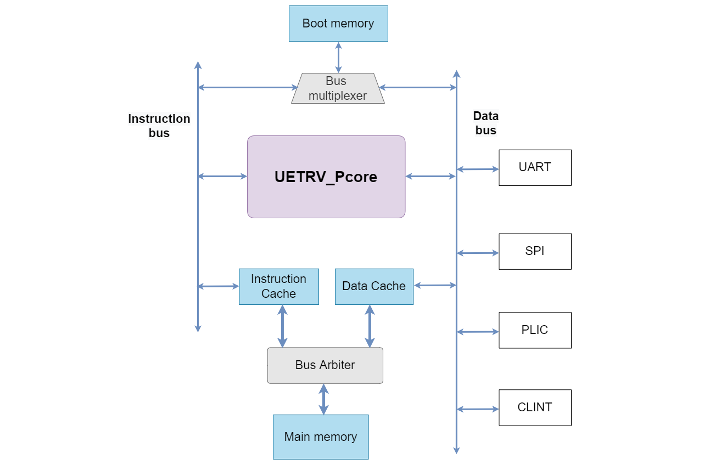

## UETRV_Pcore  
UETRV_Pcore is a RISC-V based application class SoC integrating a 5-stage pipelined processor with memory and peripherals. Currently, the core implements RV32IMA ISA based on User-level ISA Version 2.0 and Privileged Architecture Version 1.11 supporting M/S/U mode. Following is the status of current implementation:

- Machine level and Supervisor level interrupts have been added, including the support for vectored interrupts.
- Data hazards are resolved using forwarding, while Load-Use hazard leads to one cycle stall. 
- The system boots using on chip boot memory.

### Core Block Diagram



The pictorial representation of memory map is in the following picture.


The `linker.ld` file has the memory defination as follows.
```
MEMORY
{ 
  FLASH_INST (rx) : ORIGIN = 0x00000000, LENGTH = 2K
  FLASH_BOOT (rx) : ORIGIN = 0x00007000, LENGTH = 1K
  RAM       (rwx) : ORIGIN = 0x00001000, LENGTH = 2K
}
```
# Getting Started

Install RISC-V [toolchain](https://github.com/riscv-collab/riscv-gnu-toolchain) and [verilator](https://verilator.org/guide/latest/install.html). These tools can be built by following the instructions in the corresponding links, or can be installed directly by running the following command

    sudo apt-get install -y gcc-riscv64-unknown-elf verilator gtkwave

Check that these tools are installed correctly, by running `verilator --version` and `riscv64-unknown-elf-gcc -v`.

### Build Model and Run Simulation

Verilator model of Pcore can be built using Makefile:

    make verilate

The verilator model is build under `ver_work/Vpcore_sim`. The executeable can accept the following three parameters:

- `imem` : This paramerter accepts the file that contain the hexadecimal instructions of compiled program.
- `max_cycles`: This parameter cotrols the maxiumum number of cycles for simulation. Simulation terminates after executing these many cycles.
- `vcd`: This parameters accepts a boolean value. If it is 0, the waveform file `trace.vcd` will not be dumped and vice versa.

An example program to print `HELLO` on UART is compiled and its hex instructions are availabe in [here](/software/example-uart/build/imem.txt). Run the folllowing command to simulate the example program

    make sim-verilate 

This will simulate `imem.txt` and dump UART logs in `uart_logdata.log`. If `vcd=1` is added to the above command, `trace.vcd` will created that can be viewed by running

    gtkwave trace.vcd

The `imem` and `max_cycles` may be overwritten in Makefile using.

    make sim-verilate imem=</path/to/hex/file> max_cycles=<No. of cycles> 

### Verification

UET_Pcore uses RISOF framework to run Architecture Compatibility Tests (ACTs). Instructions to run these tests can be followed in [verif](/verif/) directory.
