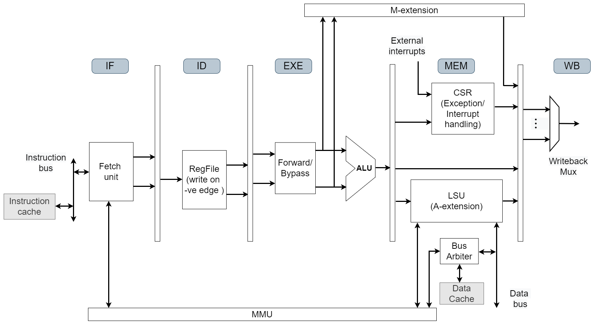
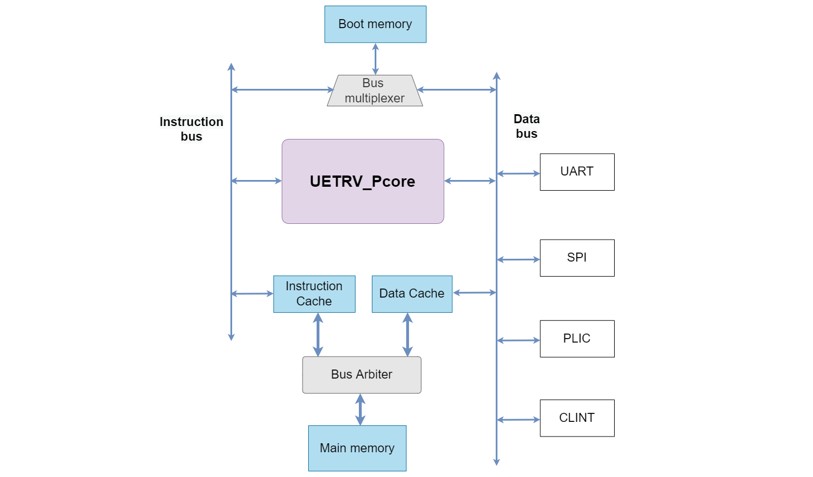

# UETRV_Pcore: Design Document
UETRV_Pcore is a RISC-V based application class SoC integrating a 5-stage pipelined processor with memory and peripherals. Currently, the core implements RV32IMAZicsr ISA based on User-level ISA Version 2.0 and Privileged Architecture Version 1.11 supporting M/S/U modes. Following are the key features of the SoC:

## Introduction

### Key Features
- 32-bit RISC-V ISA core that supports base integer (I) and multiplication and division (M), atomic (A) and Zicsr (Z) extensions (RV32IMAZicsr).
- Supports user, supervisor and machine mode privilege levels.
- Support for instruction / data (writeback) caches.
- Sv32 based MMU support and is capable of running Linux.
- Cache size, TLB entries etc., are configurable.
- Intergated PLIC, CLINT, uart, spi peripherals. 
- Uses RISOF framework to run architecture compatibility tests.

### System Design Overview
The UETRV_Pcore is an applicaion class processor capable of running Linux. A simplified 5-stage pipelined block diagram is shown below. The M-extension is implemented as a coprocessor while memory-management-unit (MMU) module is shared by instruction and data memory (alternatively called load-store-unit (LSU)) interfaces of the pipeline. Specifically, the page-table-walker (PTW) of the MMU is shared and there are separate TLBs (translation look aside buffers) for instruction and data memory interfaces. The A-extension is implemented as part of the LSU module.

The SoC block diagram shows the connectivity of the core with memory sub-system as well as different peripherals using data bus. The boot memory is connected to both instruction and data buses of the core using a bus multiplexer. The instruction and data caches share the main memory using a bus arbiter. Different necessary peripherals are connected using the data bus. 

### SoC Memory Map
The memory map for the SOC is provided in the following table.
| Base Address        |    Description            |   Attributes    |
|:-------------------:|:-------------------------:|:---------------:|
| 0x8000_0000         |      Memory               |      R-X-W      |
| 0x9000_0000         |      UART                 |      R-W        |
| 0x9400_0000         |      PLIC                 |      R-W        |
| 0x9C00_0000         |      SPI                  |      R-W        |
| 0x0200_0000         |      CLINT                |      R-W        |
| 0x0000_1000         |      Boot Memory          |      R-X        |

- `R: Read access`
- `W: Write access`
- `X: Execute access`

## Design Details
The core and SoC design details are outlined in the following subsections.
- Instruction fetch and decode stages
- Execute stage and M-extension
- Memory and writeback stages
- Pipeline controller
- MMU details
- Booting and peripherals

### Instruction fetch and decode stages
The instruction fetch stage of the pipeline reads instructions either from the boot memory (`bmem`) or from the instruction cache (`icache`). The default/reset value of the program counter (PC) starts execution from `bmem`, which normally contains the zero-order bootloader. After booting, the PC jumps to the main memory region to start user program execution. 

If virtualization is turned on then both virtual-to-physical address translation (using memory management unit (MMU)) as well as fetching the instructions from `icache` are performed during fetch stage. Cascading the two key operation can easily make this phase to become crtical path. An instruction page fault exception from the MMU (due to failuare of virtual address translation) enters the pipeline at fetch stage.    

The decode stage performs instruction decoding as well as operand fetching from the register-file. The register file write operation is performed on the falling edge of the clock to reduce the hardware cost of full forwarding.  

### Execute stage and M-extension
Execute stage implements all the integer ALU operations required by the base RV32I. The forwarding multiplexer is implemented in the execute stage. The input operands to the M-extension are provided by the execute stage, while the result from M-extension is provided to the memory stage. M-extension uses a multi-cycle implementation.  

### Memory and writeback stages
Memory stage houses load-store-unit (LSU), control-status-register (CSR) register-file and A-extension. LSU module performs load/store operaions from/to dcache as well as peripheral devices, using data bus. The load/store operations from/to peripheral devices are non-cacheable.

The memory stage also implements the CSR read/write operations including exception/interrupt handling. External interrupts are asynchronous and require synchronization for  their precise handling. An approach based on interrupt continuable instruction is followed for percise interrupt handling. For that purpose, the interrupt is put on hold if the pipeline was either stalled or being flushed at the time of occurrence of the interrupt.    

### Pipeline controller
Key operations performed by the pipeline controller involve forwarding/stalling/flushing of the pipeline stages. The current version implements full forwarding. LSU operations lead to one stall cycle. In case of load use hazard, forwarding is always performed from the writeback stage and results in an extra stall cycle. Below are some possible scenarios leading to pipeline stalls.
- Fetch/decode/execute/memory stages stall due to data TLB miss, dcache miss, executing atomic and other A-extension instructions
- Fetch/decode/execute/memory stages stall due to M-extension operation 
- Fetch stage stall due to icache miss 

Pipeline is flushed due to:
- Execution of jump or conditional-branch instruction
- Exception or interrupt handling

Execution of a jump or conditional-branch instruction leads to flushing fetch and decode stages of the pipeline. In case of an exception or interrupt fetch, decode and execute stages of the pipeline are flushed.

### MMU details

### Booting and peripherals
